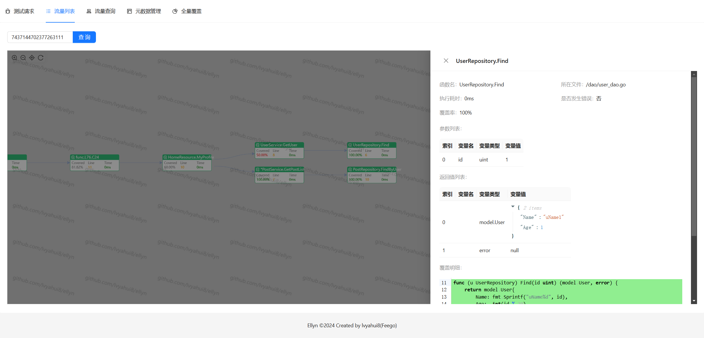

# Ellyn - Go coverage and call chain data collection tool

[](https://opensource.org/licenses/MIT)[](https://goreportcard.com/report/github.com/lvyahui8/ellyn)[](https://codecov.io/gh/lvyahui8/ellyn)

### Features

-   Supports collection of global coverage data (calculation of increments, full coverage)
-   Supports collection of function call chains (including asynchronous links)
-   Supports collection of runtime data (incoming and outgoing parameters, exceptions, time-consuming, etc.)
-   Supports collection of the above data at the granularity of a single request
-   Support concurrent collection
-   ~~Support configuration method mock~~

### Application scenarios

-   coverage statistics
-   Call chain collection
-   Data (Field) Lineage
-   Traffic observation
-   Traffic playback
-   Mock
-   Single test, automated test (obtain single use case coverage details)
-   Accurate testing
-   risk analysis
-   Unified monitoring and alarming (metrics)
-   etc

### Operating environment

-   Go Version >= 1.18
-   Linux\\Windows\\MacOS

### Demo program

[Download the example demo program](https://github.com/lvyahui8/ellyn/releases)

Download the corresponding system version and execute it, then access<http://localhost:19898>That’s it



### How to use the tool

[Download ellyn tools](https://github.com/lvyahui8/ellyn/releases)

Usage

```text
NAME:
   ellyn - Go coverage and callgraph collection tool

USAGE:
   ellyn [global options] command [command options]

COMMANDS:
   update    update code
   rollback  rollback code
   help, h   Shows a list of commands or help for one command

GLOBAL OPTIONS:
   --help, -h  show help
```

Execute in the directory where the target go project main package is located

-   ellyn update: Code instrumentation. After instrumentation, compile the code and start the service to collect data.
-   ellyn rollback: roll back the original file and clean up traces of instrumentation

### Secondary development

#### Program architecture


#### SDK core logic


#### Catalog description

-   api: Provides runtime access to the sdk (instrumentation code) api
-   benchmark: Performance benchmark test, comparing performance differences under different sampling rates in various scenarios
-   cmd: ellyn command line tool, used to perform instrumentation on the target project
-   example: Demonstration program. Demonstrate data collection effect
-   instr: instrumentation logic, traverse the target project file, and implant ellyn sdk code
-   sdk: The sdk called by the instrumentation code. This directory is copied to the target project and participates in compilation as part of the target project. Non-go official dependencies cannot be used in this directory (except test files)
-   test: project test basic code
-   viewer: simple version of the visualization page

#### Development points

-   Avoid resource conflicts/lock competition, lock-free priority
-   Core functions must operate in O(1)
-   Highly accessed fields must be cached to prevent false sharing.
-   You can sacrifice some space for time
-   Try to use array/bitmap instead of go official map
-   Objects created frequently are pooled based on sync.Pool to reduce GC pressure.
-   Parameter collection should consider the impact of large value transfer (copy) on performance

#### Sdk components and uses

-   [RingBuffer](./sdk/common/collections/ringbuffer.go): Buffer call data
    -   [RingBuffer performance test](./sdk/common/collections/ringbuffer.md)
    -   [RingBuffer and Map performance comparison test](./sdk/common/collections/ring_buffer_vs_map.md)
-   [LinkedQueue](./sdk/common/collections/linked_queue.go): Synchronous queue based on linked list. Task queue used as coroutine pool
-   [hmap(SegmentHashmap)](./sdk/common/collections/hmap.go): Implement high-performance routineLocal
    -   [hmap performance test](./sdk/common/collections/hmap.md)
-   [bitmap](./sdk/common/collections/bitmap.go): Record the execution of functions and blocks
-   [UnsafeCompressedStack](./sdk/common/collections/stack.go): Simulate pushing and popping into the stack
    -   [Stack performance test](./sdk/common/collections/stack.md)
-   [routineLocal/GLS/GoRoutineLocalStorage](./sdk/common/goroutine/routine_local.go): cache context
    -   [routineLocal performance test](./sdk/common/goroutine/routine_local_test.go)
-   [routinePool](./sdk/common/goroutine/routine_pool.go): coroutine pool, concurrent file processing
-   [int64 UUID Generator](./sdk/common/guid/guid.go): Generate call id
-   [AsyncLogger](./sdk/common/logging/readme.md): High-performance asynchronous logging

### Performance testing

-   There is a certain impact on CPU-intensive scenes, even if the sampling rate is very low
-   Little impact on IO-intensive scenarios, even with high sampling rates

[Detailed data](./benchmark/result.md)

### Q&A

#### Q: Why implement part of the collection library instead of directly using open source solutions?

A: This part of the implementation will be copied to the target warehouse, firstly to ensure that it does not conflict with the target warehouse SDK, and secondly to optimize performance for the current scenario, so it is implemented by itself. For the code of the target warehouse that is not copied, priority is given to reusing open source implementations.
