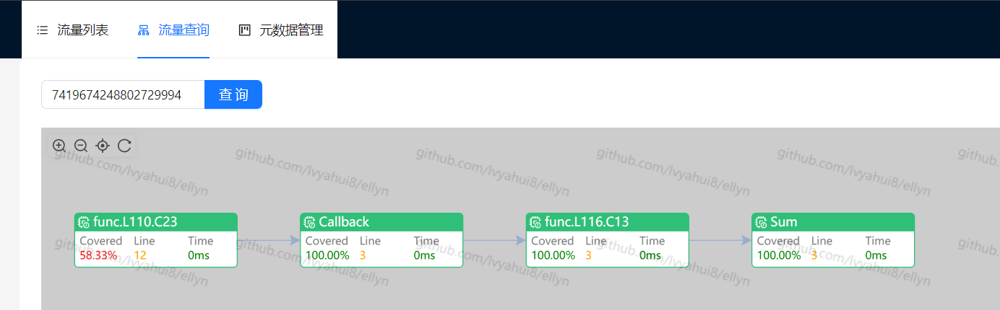

# Ellyn - Go 覆盖率、调用链数据采集工具

[](https://opensource.org/licenses/MIT)
[](https://goreportcard.com/report/github.com/lvyahui8/ellyn)
[](https://codecov.io/gh/lvyahui8/ellyn)

### 功能特性

- 支持收集全局覆盖数据（计算增量、全量覆盖率）
- 支持收集函数调用链（包含异步链路）
- 支持收集运行时数据（出入参、异常、耗时等）
- 支持收集单个请求粒度的上述数据
- 支持并发收集
- ~~支持配置方法mock~~


### 应用场景

- 覆盖率统计
- 调用链收集
- 数据（字段）血缘
- 流量观测
- 流量回放
- Mock
- 单测、自动化测试(获取单个用例覆盖明细)
- 精准测试
- 风险分析
- 统一监控告警(metrics)
- etc

### 运行环境

- Go Version >= 1.18
- Linux\Windows\MacOS

### 演示程序

[下载example演示程序](https://github.com/lvyahui8/ellyn/releases)

下载对应系统版本执行，然后访问[http://localhost:19898](http://localhost:19898)即可



### 工具使用方法

[下载ellyn工具](https://github.com/lvyahui8/ellyn/releases)

Usage
```text
NAME:
   ellyn - Go coverage and callgraph collection tool

USAGE:
   ellyn [global options] command [command options]

COMMANDS:
   update    update code
   rollback  rollback code
   help, h   Shows a list of commands or help for one command

GLOBAL OPTIONS:
   --help, -h  show help
```

在目标go项目main package所在目录执行

- ellyn update: 代码插桩，插桩之后编译代码启动服务，即可收集数据
- ellyn rollback: 回滚原文件，清理插桩痕迹

### 二次开发

#### 目录说明

- api: 提供运行时访问sdk（插桩代码）的api
- benchmark: 性能基准测试，对比各种场景不同采样率下的性能差异
- cmd: ellyn命令行工具，用于对目标项目执行插桩
- example: 演示程序。演示数据采集效果
- instr: 插桩逻辑，遍历目标项目文件，植入ellyn sdk代码
- sdk: 插桩代码调用的sdk，此目录拷贝到目标项目，作为目标项目的一部分参与编译。此目录不能使用非go官方依赖（test文件除外）
- test: 项目测试基础代码
- viewer: 简易版的可视化页面

#### 开发要点

- 避免资源冲突/锁竞争， 无锁优先
- 核心函数必须O(1)操作
- 高频访问的字段必须缓存行填充，防止伪共享
- 可以牺牲部分空间换时间
- 尽量用array/bitmap而非go官方map
- 高频创建使用的对象基于sync.Pool池化，减少gc压力
- 参数收集要考虑大值传递（拷贝）对性能影响

#### Sdk组件及用途

- [RingBuffer ](./sdk/common/collections/ringbuffer.go) : 缓冲流量数据
  - [RingBuffer性能测试](./sdk/common/collections/ringbuffer.md)
  - [RingBuffer与Map性能对比测试](./sdk/common/collections/ring_buffer_vs_map.md)
- [LinkedQueue](./sdk/common/collections/linked_queue.go): 基于链表的同步队列。用作协程池的任务队列
- [hmap(SegmentHashmap)](./sdk/common/collections/hmap.go): 实现高性能的routineLocal
  - [hmap性能测试](./sdk/common/collections/hmap.md)
- [bitmap](./sdk/common/collections/bitmap.go): 记录函数、块的执行情况
- [UnsafeCompressedStack](./sdk/common/collections/stack.go) : 模拟入栈弹栈
  - [Stack性能测试](./sdk/common/collections/stack.md)
- [routineLocal/GLS/GoRoutineLocalStorage](./sdk/common/goroutine/routine_local.go): 缓存上下文
  - [routineLocal性能测试](./sdk/common/goroutine/routine_local_test.go)
- [routinePool](./sdk/common/goroutine/routine_pool.go): 协程池，并发处理文件
- [Uint64GUIDGenerator](./sdk/common/guid/guid.go): 生成流量id
- [AsyncLogger](./sdk/common/logging/readme.md): 高性能异步日志

### 性能测试

- 对CPU密集型场景存在一定影响，即使采样率很低
- 对IO密集型场景影响很小，即使采样率很高

[明细数据](./benchmark/result.md)

### Q&A 

#### Q:为什么要实现部分集合库，而不是直接使用开源方案？

A: 这部分实现会拷贝到目标仓库，一是为确保不与目标仓库sdk冲突，二是针对当前场景做性能优化，因此自行实现。对于不拷贝的目标仓库的代码，优先考虑用复用开源实现
