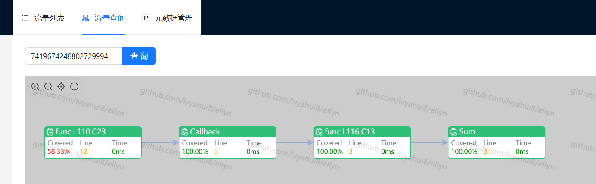
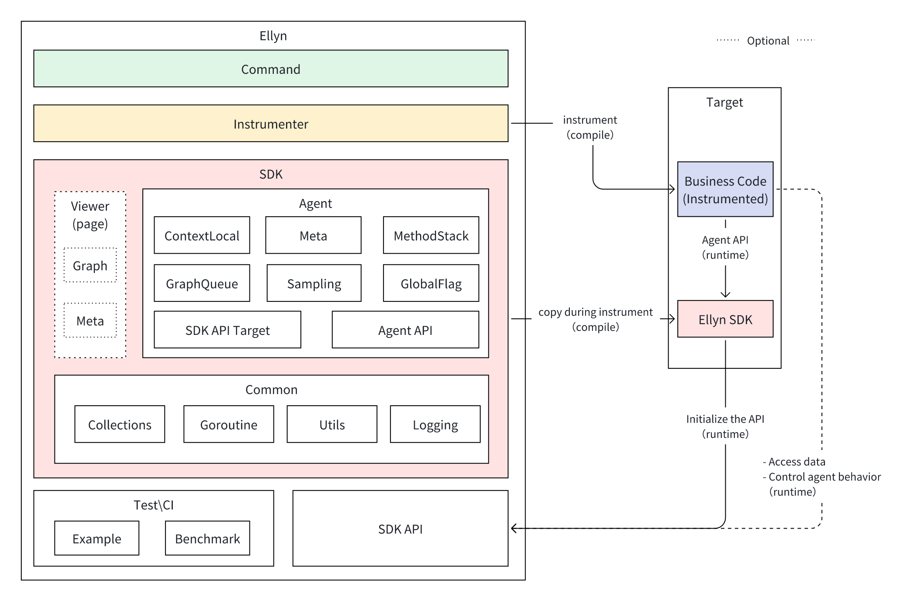
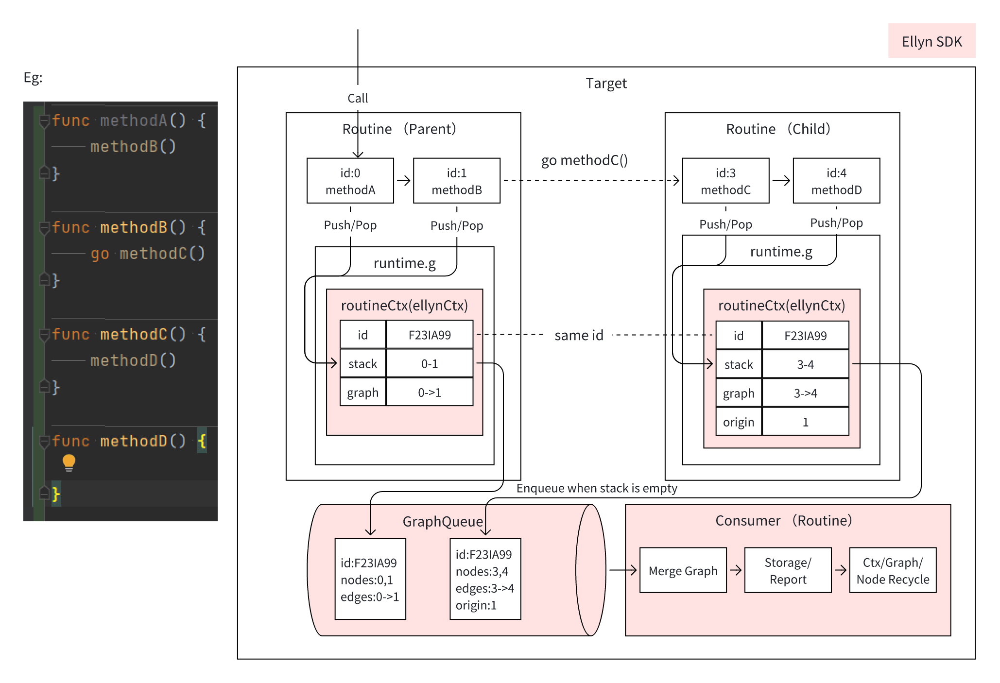

# Ellyn

Go 覆盖率、调用链与运行时数据采集工具。

[](https://opensource.org/licenses/MIT)
[](https://goreportcard.com/report/github.com/lvyahui8/ellyn)
[](https://codecov.io/gh/lvyahui8/ellyn)

**语言:** [English](README.md) | 简体中文

Ellyn 通过对 Go 应用进行代码插桩，采集请求粒度的覆盖率、函数调用链、异步链路，以及参数、返回值、异常、耗时等运行时数据。它适用于覆盖率统计之外的观测、精准测试、流量回放和风险分析等场景。

## 功能特性

- 支持全局覆盖率采集，可用于全量和增量覆盖率分析。
- 支持函数调用链采集，包含异步链路。
- 支持运行时数据采集，包括入参、出参、异常和耗时。
- 支持按单个请求粒度采集覆盖率、调用链和运行时明细。
- 支持并发采集。
- SDK 核心组件面向高频运行时路径做了性能优化。
- Mock 能力仍在规划中，当前暂不可用。

## 应用场景

- 覆盖率统计与单个用例覆盖明细。
- 调用链追踪与运行时观测。
- 数据和字段血缘分析。
- 流量观测与流量回放。
- 精准测试和自动化测试。
- 风险分析。
- 统一 metrics、监控和告警。

## 运行环境

- Go 1.18 或更高版本。
- Linux、macOS 或 Windows。

## 演示程序

从 [GitHub Releases](https://github.com/lvyahui8/ellyn/releases) 下载对应系统的演示程序，运行后访问 [http://localhost:19898](http://localhost:19898)。



## 命令行使用

从 [GitHub Releases](https://github.com/lvyahui8/ellyn/releases) 下载 `ellyn` 命令行工具。

```text
NAME:
   ellyn - Go coverage and callgraph collection tool

USAGE:
   ellyn [global options] command [command options]

COMMANDS:
   update    update code
   rollback  rollback code
   help, h   Shows a list of commands or help for one command

GLOBAL OPTIONS:
   --help, -h  show help
```

在目标 Go 项目 `main` package 所在目录执行：

```shell
ellyn update
```

`ellyn update` 会对项目进行插桩。插桩完成后，重新编译并启动目标服务即可采集数据。

```shell
ellyn rollback
```

`ellyn rollback` 会还原原始文件并清理插桩痕迹。

## 目录结构

- `api`: 提供访问插桩 SDK 的运行时 API。
- `benchmark`: 性能基准测试，用于对比不同场景、不同采样率下的开销。
- `cmd`: `ellyn` 命令行工具。
- `example`: 演示程序，用于查看数据采集效果。
- `instr`: 插桩逻辑，负责遍历目标 Go 文件并注入 SDK 调用。
- `sdk`: 插桩代码调用的 SDK，会被复制到目标项目并作为目标项目的一部分参与编译。
- `test`: 共享测试辅助代码。
- `viewer`: 轻量级可视化页面。

## 程序架构



## SDK 核心流程



## 开发要点

SDK 会被复制到目标项目，因此运行时代码应尽量减少依赖，并保持高频路径的性能稳定：

- 优先考虑无锁设计，减少资源冲突和锁竞争。
- 核心操作保持 `O(1)`。
- 高频访问字段需要填充缓存行，减少伪共享。
- 在合理范围内用空间换时间。
- 高频路径优先使用 array 和 bitmap，谨慎使用 Go map。
- 高频创建的对象通过 `sync.Pool` 复用，降低 GC 压力。
- 参数采集需要关注大值复制带来的性能影响。

## SDK 组件

- [RingBuffer](./sdk/common/collections/ringbuffer.go): 缓冲调用数据。
  - [RingBuffer 性能测试](./sdk/common/collections/ringbuffer.md)
  - [RingBuffer 与 Map 性能对比](./sdk/common/collections/ring_buffer_vs_map.md)
- [LinkedQueue](./sdk/common/collections/linked_queue.go): 基于链表的同步队列，用作协程池任务队列。
- [hmap / SegmentHashmap](./sdk/common/collections/hmap.go): 高性能 routine-local 存储实现。
  - [hmap 性能测试](./sdk/common/collections/hmap.md)
- [bitmap](./sdk/common/collections/bitmap.go): 记录函数和代码块执行情况。
- [UnsafeCompressedStack](./sdk/common/collections/stack.go): 模拟入栈和出栈操作。
  - [Stack 性能测试](./sdk/common/collections/stack.md)
- [routineLocal / GLS / GoRoutineLocalStorage](./sdk/common/goroutine/routine_local.go): 缓存 goroutine 上下文。
  - [routineLocal 性能测试](./sdk/common/goroutine/routine_local_test.go)
- [routinePool](./sdk/common/goroutine/routine_pool.go): 协程池，用于并发文件处理。
- [Uint64GUIDGenerator](./sdk/common/guid/guid.go): 生成调用 ID。
- [AsyncLogger](./sdk/common/logging/readme.md): 高性能异步日志。

## 性能

- CPU 密集型场景会有一定影响，即使采样率较低。
- IO 密集型场景影响通常较小，即使采样率较高。

查看 [benchmark 明细](./benchmark/result.md)。

## FAQ

### 为什么要自己实现部分集合工具，而不是直接使用开源方案？

部分 SDK 代码会复制到目标仓库。自研实现可以避免与目标仓库依赖冲突，同时针对 Ellyn 的运行时采集路径做性能优化。对于不会复制到目标项目的代码，仍然优先复用成熟的开源实现。
